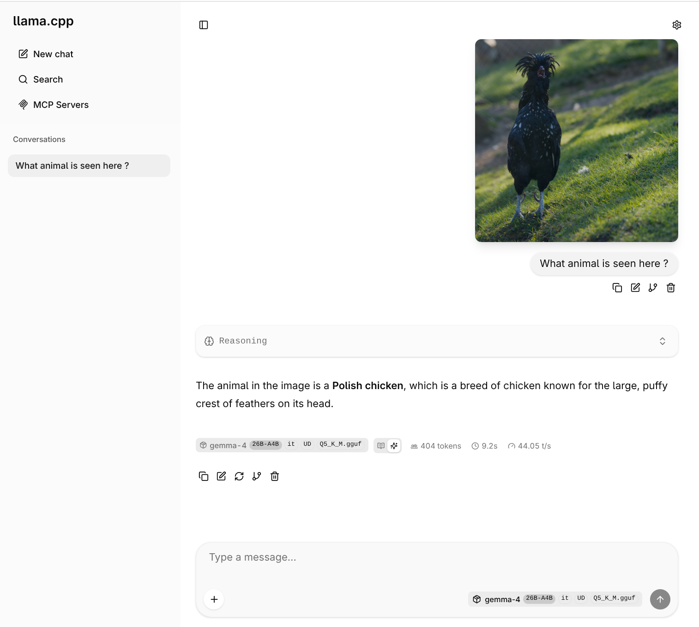
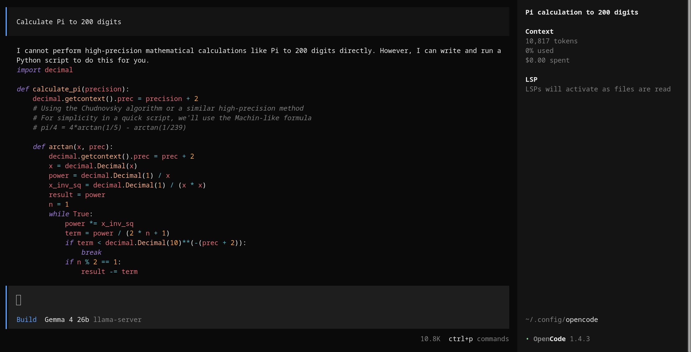
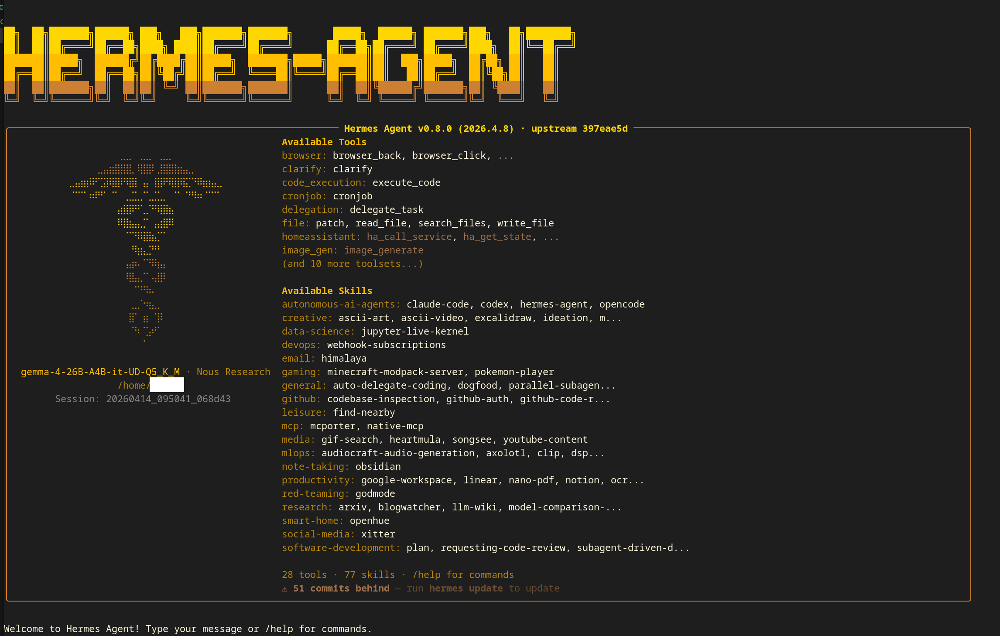

# Gemma 4 26B on RTX 3090: Optimized Inference & Vision Guide


## Introduction

**Run the Gemma 4 26B MoE model with full vision capabilities on a single 24GB VRAM RTX 3090.**

Just wanted to share my setup utilizing a 3090 GPU. Hope it may be useful for others :-)

This repository provides a short guide and optimized configuration for building a high-performance local LLM environment. By leveraging a dedicated `llama.cpp` fork with **TurboQuant** support ([AmesianX/TurboQuant](https://github.com/AmesianX/TurboQuant.git)), you can achieve:

- **Long Context**: Up to **256k tokens** (TurboQuant) for deep document analysis.
- **High Throughput**: Generation speeds of ~100 tokens/sec on the 3090 hardware.
- **VRAM Efficiency**: Fully offload 26B MoE weights to a single 24GB GPU.
- **Multimodal Support**: Integrated vision processing for UI automation and image analysis.
- **Agent Orchestration**: Native support for [OpenCode](https://github.com/anomalyco/opencode) and [Hermes](https://github.com/NousResearch/hermes-agent).


## Expected Performance

| Metric | Value |
| :--- | :--- |
| **Model** | Gemma-4-26B-A4B-it-UD-Q5_K_M + mmproj-F16.gguf|
| **Generation Speed** | ~ 50 tokens/sec |
| **Max Context Limit one slot** | 262144 |
| **Max Context Limit two slots** | ca. 2*262144 |


---

## Section 0: Initial Machine Setup & TurboQuant Build of Llama.cpp

### Build steps
The following commands outline how this was configured on a linux PC hosting the RTX 3090 CPU. Note that the first two commands are only needed on AlmaLinux 8.9 to avoid compiler conflicts. The 

```bash
# 1. For Almalinux 8.9 only: Install necessary dependencies, utilizing GCC 12
sudo dnf install -y gcc-toolset-12 cmake git

# 2. For Almalinux 8.9 only: Enter a GCC 12 shell environment (Important!)
scl enable gcc-toolset-12 bash

# 3. Clone the TurboQuant fork
git clone https://github.com/AmesianX/TurboQuant.git
cd TurboQuant

# 4. Generate build files (configured for RTX 3090 compute capability 8.6)
cmake -B build -DGGML_CUDA=ON -DCMAKE_CUDA_ARCHITECTURES=86 -DCMAKE_BUILD_TYPE=Release

# 5. Compile using all logical cores (that takes some time...)
cmake --build build --config Release -j$(nproc)
```

### Model Download Instructions

I recommend keeping models consolidated (e.g. `/data/models/gguf`). You will need the main context model and the vision projector (`mmproj`) to support image tasks.

#### Approach A: Using simple `wget` or `curl`
```bash
mkdir -p /data/models/gguf
cd /data/models/gguf

# Download Gemma 4 model (Replace URL with exact huggingface model resolver)
wget -q --show-progress https://huggingface.co/unsloth/gemma-4-26B-A4B-it-GGUF/resolve/main/gemma-4-26B-A4B-it-UD-Q5_K_M.gguf

# Download mmproj for vision support
wget -q --show-progress https://huggingface.co/unsloth/gemma-4-26B-A4B-it-GGUF/resolve/main/mmproj-F16.gguf
```

#### Approach B: Using HF CLI tool (`hf`)
```bash
# Install the HF CLI tool
curl -LsSf https://hf.co/cli/install.sh | bash -s

# Download files into specific local directory
hf download unsloth/gemma-4-26B-A4B-it-GGUF gemma-4-26B-A4B-it-UD-Q5_K_M.gguf --local-dir /data/models/gguf
hf download unsloth/gemma-4-26B-A4B-it-GGUF mmproj-F16.gguf --local-dir /data/models/gguf
```

### Run the model

Note that in the following it is assumed that the GPU is not used for other purposes other than running the Gemma models (e.g. a headless server machine). If this is not the case for you you may have to lower the context size values.

Keep mmproj files on RAM (no offloading to GPU) and enable turboquant cache types (tbqp3/tbq3). Make sure that Flash-Attention buffer spikes do not hurt you (ubatch-size), but is still big enough to cope with images (>273 tokens). Allow to read the model remotely on port 8000

```bash
cd TurboQuant

./build/bin/llama-server \
  -m /data/models/gguf/gemma-4-26B-A4B-it-UD-Q5_K_M.gguf \
  --host 0.0.0.0 --port 8000 \
  --gpu-layers 30 \
  --flash-attn on \
  --jinja \
  -np 1 \
  -c 262144 \
  --cache-type-k tbqp3 \
  --cache-type-v tbq3 \
  --mmproj /data/models/gguf/mmproj-F16.gguf
  --no-mmproj-offload
  --ubatch-size 288

```
---

## Section 1: Using Model Directly via llama.cpp Web Interface

You can seamlessly use the built-in web endpoint for inference on port 8000 (accessible on `http://<server-ip>:8000` or `http://localhost:8000`).

 

---

## Section 2: Connecting the Model to [OpenCode](https://github.com/anomalyco/opencode)

The OpenCode agent can interact seamlessly with your new llama-server APIs using the built-in provider configurations.

To connect OpenCode on your development client (e.g. laptop):
1. Setup your `config.json` inside your user's `~/.config/opencode` folder:
```json
{
  "$schema": "https://opencode.ai/config.json",
  "provider": {
    "llamacpp": {
      "npm": "@ai-sdk/openai-compatible",
      "name": "llama-server",
      "options": {
        "baseURL": "http://<server-ip>:8000/v1"
      },
      "models": {
        "gemma-4-26B-A4B-it-UD-Q5_K_M": {
          "name": "Gemma 4 26b",
          "modalities": {
            "input": ["image", "text"],
            "output": ["text"]
          }
        }
      }
    }
  }
}
```

 

*Because your `llama-server` has the `--mmproj` attached, OpenCode can immediately push valid image data and successfully analyze local UI snapshots in headless modes.*

---

## Section 3: Connecting [Hermes](https://github.com/NousResearch/hermes-agent) to [OpenCode](https://github.com/anomalyco/opencode) (Adjusted Setup)

To allow the Hermes framework to orchestrate OpenCode tasks in parallel on the same server, changes are necessary to both the Server and Hermes configurations. Please make sure that you are running a hardened Hermes setup to avoid any surprises !

### 1. Server-Side Changes for Parallel Slots
When Hermes and OpenCode run queries iteratively, maintaining multiple active requests is important. Start `llama-server` using `-np 2` to add an additional parallel context slot, increasing context sharing resilience between Hermes and OpenCode tasks, while reducing the context size per slot to about 150k (tune this parameter for your specific needs).

```bash
./build/bin/llama-server [other parameters...] -np 2 -c 300000
```

### 2. Hermes Configuration
Put the following into `.hermes/config.yaml` to point your Hermes default handler onto the remote llama-server provider and model.

```yaml
model:
  default: gemma-4-26B-A4B-it-UD-Q5_K_M.gguf
  provider: custom
  base_url: http://<server-ip>:8000/v1
providers: {}
```

### 3. Using the opencode skill to delegate coding tasks
Use the command /opencode to activate the opencode skill for hermes. You may have to tell hermes, that no authentication is needed to connect to opencode.

 

### 4. Add brave search mcp server

Add to .hermes/config.yaml:
```yaml
mcp_servers:
    brave-search:
      command: npx
      args:
        - -y
        - "@brave/brave-search-mcp-server"
      env:
        BRAVE_API_KEY: "your BRAVE API key"
```

### 5. Git Worktrees for Parallel Execution
Hermes prefers executing concurrent AI activities utilizing **Git Worktrees**. When assigning multiple agents, instead of traditional branch checking, instruct (or allow) Hermes to perform a checkout onto new branch folders out-of-line:
```bash
git worktree add ../feature-ui feature/new-ui
```
This restricts node_modules re-installation conflicts and stops isolated agents from breaking each other's environments/contexts accidentally!