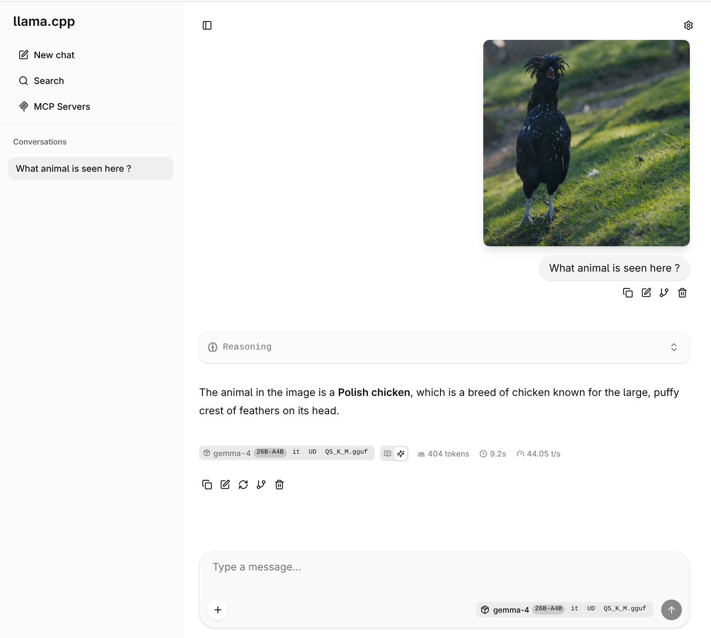
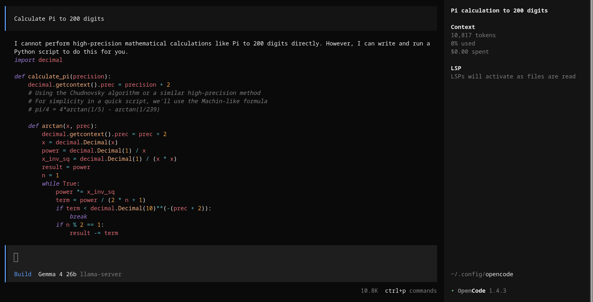
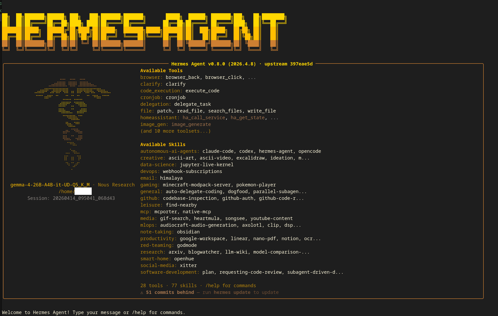

# Qwen3.8-27B on RTX 3090: Optimized Inference & Vision Guide


## Introduction

**Run Qwen3.8-27B with full vision capabilities and a 192k context on a single 24GB VRAM RTX 3090.**

Just wanted to share my setup utilizing a 3090 GPU. Hope it may be useful for others :-)

> This repo started life as a Gemma 4 26B guide (hence the repository name). Gemma 4 is still a
> perfectly good option and its configuration is preserved in [Appendix A](#appendix-a-gemma-4-26b-moe-the-previous-setup).
> Qwen3.8-27B has since become the better default on this hardware, so it now leads the guide.

Unlike the earlier Gemma setup, this configuration uses **upstream `llama.cpp`**, not a fork. Qwen3.8's
hybrid attention needs recent CUDA kernels that only exist upstream, and the TurboQuant fork this repo
previously recommended has been archived without Qwen3.8 support.

- **Long Context**: **196,608 tokens** in a single slot, measured, with vision attached.
- **Speculative Decoding**: built-in MTP draft head, ~1.5x decode speedup for free.
- **VRAM Efficiency**: dense 27B fully offloaded to one 24GB card.
- **Multimodal Support**: image input for UI automation and image analysis.
- **Agent Orchestration**: [Qwen Code](https://github.com/QwenLM/qwen-code), [OpenCode](https://github.com/anomalyco/opencode) and [Hermes](https://github.com/NousResearch/hermes-agent).

## Expected Performance

All figures **measured** on the reference host (RTX 3090 24GB, Xeon E3-1225 v5, AlmaLinux 8.9,
driver 595.58.03, llama.cpp build 10577):

| Metric | Value |
| :--- | :--- |
| **Model** | Qwen3.8-27B-UD-Q4_K_XL + mmproj-F16 + MTP draft head |
| **Generation Speed** | **45.6 tokens/sec** (MTP `--spec-draft-n-max 2`) |
| **Draft Acceptance** | 0.63 - 0.75 depending on workload |
| **Prompt Processing** | **912 tokens/sec** (measured over a 68,801-token prompt) |
| **Max Context (one slot)** | **196608** |
| **VRAM at 196608 + vision** | 23108 / 24576 MiB (23130 after a 64k fill) |
| **Max Context without MTP** | ~262144 (at ~30 tok/s - usually a bad trade) |

### Why this model

Qwen3.8-27B is a dense 27B with a **hybrid attention** stack: of its 64 layers, only every 4th is full
attention (16 layers, 4 KV heads, head_dim 256); the other 48 are Gated DeltaNet linear-attention layers
whose recurrent state is constant-size. So the KV cache grows at **64 KiB/token at f16** instead of the
~256 KiB/token a conventional dense 27B would need. That is what makes 192k fit on a 24GB card at all.

Published head-to-heads on a 24GB card (llama.cpp, Q4_K_M, same harness):

| Task | Qwen3.8-27B | Qwen3.6-27B | Gemma 4 31B |
| :--- | :--- | :--- | :--- |
| Coding pass@1 | **12/12** | 8/12 | 6/12 |
| Reasoning | **117/120** | 28/120 | 104/120 |
| Document QA | **23/24** | 8/24 | 22/24 |
| Vision | 18/20 | 17/20 | **19/20** |
| Decode tok/s | 49 | 49 | 45 |

Gemma 4 keeps a small edge on pure vision work and on LiveCodeBench; Qwen3.8 wins decisively on the
multi-turn agentic reliability that matters for OpenCode/Hermes loops.

### The real cost of long context

Raising `--ctx-size` is nearly free; *filling* it is not. At 912 tok/s prefill, a full 196608-token
prompt takes about **3.6 minutes** before the first token appears. VRAM does not move during that fill
(the KV cache is preallocated at load), so a long session cannot OOM you mid-conversation - but budget
the wall-clock time. Prefix caching makes this a one-off cost per conversation rather than per turn.

---

## Section 0: Build upstream llama.cpp

Qwen3.8's DeltaNet layers had a CUDA bug that produced **silent garbage output at normal speed** in older
builds. The minimum good commit is `ece963f41` (~build 10450). Build from master.

```bash
# 1. For AlmaLinux 8.9 only: install dependencies, utilizing GCC 12
sudo dnf install -y gcc-toolset-12 cmake git

# 2. For AlmaLinux 8.9 only: enter a GCC 12 shell environment (Important!)
scl enable gcc-toolset-12 bash

# 3. Clone upstream llama.cpp (NOT the archived TurboQuant fork - no Qwen3.8 support)
git clone https://github.com/ggml-org/llama.cpp
cd llama.cpp

# 4. Generate build files (configured for RTX 3090 compute capability 8.6)
export CUDACXX=/usr/local/cuda/bin/nvcc
cmake -B build -DGGML_CUDA=ON -DCMAKE_CUDA_ARCHITECTURES=86 \
      -DCMAKE_BUILD_TYPE=Release -DLLAMA_CURL=OFF

# 5. Compile (that takes some time...)
# NOTE: each nvcc job peaks at ~2 GB RAM. On a low-memory host, -j$(nproc) will OOM.
# Rule of thumb: -j$(nproc), but no more than (available RAM in GB / 2).
# The reference host (4 cores, 16 GB RAM shared with other services) uses -j2 and takes ~2h.
cmake --build build --config Release -j2
```

> **Build the tree on a large data volume, not `/home` or `/`.** A CUDA build tree runs 5-8 GB.
> The reference host builds in `/garagedata/build/llama.cpp`.

> **If you are upgrading an existing tree**, replacing only the executable is not enough. You must also
> update `libggml.so`, `libggml-cuda.so` and `libllama.so`. A stale `LD_LIBRARY_PATH` silently
> reintroduces the garbage-output bug. Check with `ldd build/bin/llama-server`.

### Verify the build

```bash
./build/bin/llama-server --version         # expect build >= 10450
./build/bin/llama-server --help | grep spec-type   # must list draft-mtp
```

---

## Section 1: Model Download

I recommend keeping models consolidated. The reference host uses `/garagedata/models/gguf`
(a large data volume, **not** the OS or `/home` volume - these files are ~20 GB each);
adjust every path below to your own storage.

You need three files: the model, the vision projector, and the MTP draft head. Unsloth ships the
MTP head **separately** rather than embedded in the main GGUF.

> **Warning - filename collision.** Unsloth's projector is named `mmproj-F16.gguf` for *every* model.
> If you already have a Gemma (or other) `mmproj-F16.gguf` in the same directory, downloading naively
> will silently overwrite it. Rename on download, as below.

```bash
mkdir -p /garagedata/models/gguf
cd /garagedata/models/gguf
B=https://huggingface.co/unsloth/Qwen3.8-27B-GGUF/resolve/main

wget -c -O Qwen3.8-27B-UD-Q4_K_XL.gguf  "$B/Qwen3.8-27B-UD-Q4_K_XL.gguf"   # 16.35 GiB
wget -c -O mmproj-Qwen3.8-27B-F16.gguf  "$B/mmproj-F16.gguf"               # 885 MiB  (renamed!)
wget -c -O mtp-Qwen3.8-27B-Q4_0.gguf    "$B/MTP/mtp-Qwen3.8-27B-Q4_0.gguf" # 1.28 GiB
```

Or use the bundled script: `./download_model.sh`

**Do not go below Q4 on this model** - multiple reports of quality collapsing at Q3. `UD-Q4_K_XL` is the
sweet spot on a 24GB card; `UD-IQ4_XS` (15.6 GB) buys ~1 GB of extra KV headroom if you need it.

Verify the downloads are complete files, not truncated HTML error pages:

```bash
for f in Qwen3.8-27B-UD-Q4_K_XL.gguf mmproj-Qwen3.8-27B-F16.gguf mtp-Qwen3.8-27B-Q4_0.gguf; do
  printf "%-36s " "$f"; head -c4 "$f" | od -c | head -1     # must print: G G U F
done
```

---

## Section 2: Run the model

Assumes the GPU is not used for anything else (headless server). Lower `--ctx-size` if it is.

```bash
cd llama.cpp
M=/garagedata/models/gguf

./build/bin/llama-server \
  -m $M/Qwen3.8-27B-UD-Q4_K_XL.gguf \
  --alias qwen3.8-27b \
  --host 0.0.0.0 --port 8000 \
  -ngl 999 \
  -fa on \
  --jinja \
  -np 1 -n -1 \
  -fit off \
  --ctx-size 196608 \
  --cache-type-k q4_0 --cache-type-v q4_0 \
  --spec-type draft-mtp \
  -md $M/mtp-Qwen3.8-27B-Q4_0.gguf \
  --spec-draft-n-max 2 \
  --ubatch-size 512 \
  --cache-ram 512 \
  --mmproj $M/mmproj-Qwen3.8-27B-F16.gguf \
  --no-mmproj-offload
```

### Why each flag

| Flag | Reason |
| :--- | :--- |
| `-ngl 999` | Dense model, fully offloaded. Unlike the Gemma MoE setup, no partial offload - the CPU stops mattering at decode. |
| `--spec-type draft-mtp` + `-md` | The MTP head is a built-in draft model. ~1.5x decode for ~1.3 GiB. **Both flags are required** because unsloth ships the head as a separate file. |
| `--spec-draft-n-max 2` | Acceptance falls as draft depth rises. n=2 measured best here; n=3 is worth an A/B on faster cards. |
| `-fa on` | ~2.3 GB saved, ~18% faster prefill, no decode cost. Never leave it off. |
| `--cache-type-k/v q4_0` | q4_0 KV is *both* faster and smaller than f16. See the KV table below. |
| `-fit off` | `--fit` silently shrinks unset args to fit VRAM. Turn it off so your context setting means what it says. |
| `--cache-ram 512` | **Defaults to 8192 MiB of host RAM.** On a low-RAM host that thrashes instantly. |
| `--ubatch-size 512` | Keep >= 288 so image tokens fit in one physical batch. |
| `--no-mmproj-offload` | Keeps the vision tower in host RAM, freeing VRAM for KV. Costs ~885 MB of RAM. |

### VRAM budget

Only 16 of 64 layers hold a KV cache (4 KV heads x head_dim 256 x K+V = 32768 elements/token):

| Context | K/V f16 | K/V q8_0 | K/V q4_0 |
| :--- | ---: | ---: | ---: |
| 131,072 | 8.0 GiB | 4.25 GiB | 2.25 GiB |
| 163,840 | 10.0 GiB | 5.3 GiB | 2.8 GiB |
| 196,608 | 12.0 GiB | 6.4 GiB | 3.4 GiB |
| 262,144 | 16.0 GiB | 8.5 GiB | 4.5 GiB |

Against a 24 GiB card:

```
UD-Q4_K_XL weights   16.35 GiB
MTP draft head        1.28 GiB   <- plus its OWN ~1 GiB KV buffer
compute + FA          ~1.3 GiB
KV @196608 q4_0        3.4 GiB
                     ---------
                      23.1 GiB   (measured: 23108 MiB)
```

**`--ctx-size 262144` fails on a 24GB card with MTP enabled**, and the error is easy to misread:

```
alloc_tensor_range: failed to allocate CUDA0 buffer of size 1073741824
llama_init_from_model: failed to initialize the context: failed to allocate buffer for kv cache
common_speculative_init_result: failed to create MTP context
```

That 1 GiB buffer is the **draft model's** KV cache, not the main one. Drop `--spec-type` and 262144
fits, at roughly two-thirds the decode speed.

### Sampling

| Mode | Settings |
| :--- | :--- |
| Thinking (default) | `temp 1.0, top_p 0.95, top_k 20, min_p 0.0` |
| Non-thinking | `temp 0.7, top_p 0.80, top_k 20, presence_penalty 1.5` |
| **Tool-heavy agentic coding** | `temp ~0.6` - do not carry the 1.0 thinking default into agent loops |

The largest single lever is reasoning effort, which outweighs every server flag combined.
The chat template accepts exactly three values - **`xhigh` (template default), `medium`, `low`**.
`high` is silently aliased to `xhigh`; anything else (including `none`/`off`) raises a Jinja
exception and the request fails with HTTP 500:

```bash
--chat-template-kwargs '{"reasoning_effort":"medium"}'
```

To disable thinking entirely there is a **separate** switch - `reasoning_effort` has no "off" value:

```bash
--chat-template-kwargs '{"enable_thinking":false}'
```

Both are also settable per request, which is how you vary effort prompt-to-prompt without a restart.
`llama-server` accepts `reasoning_effort` as a top-level field and maps it into the template, so
`{"reasoning_effort":"low"}` and `{"chat_template_kwargs":{"reasoning_effort":"low"}}` are equivalent.

> **Set `--min-p 0.0` explicitly.** The GGUF carries Qwen's `temp 1.0 / top_p 0.95 / top_k 20`, so
> those apply even with no flags - but `min_p` is not in that metadata and falls back to llama.cpp's
> own default of `0.05`, which stacks on top of top-k/top-p and over-constrains the distribution.
> Check what you actually got with `curl -s localhost:8000/props`.

> **Tool-calling caveat.** The official Qwen3.8 chat template has a known tool-calling bug - failed calls,
> empty-think poisoning, and agentic stalls. If harness runs stall, try a community template
> ([froggeric/Qwen-Fixed-Chat-Templates](https://huggingface.co/froggeric/Qwen-Fixed-Chat-Templates))
> via `--chat-template-file`. Test tool-calling end to end before blaming the model.

---

## Section 3: Running as a service (and swapping models)

Because the card fits exactly one of these models at a time, the clean pattern is one systemd unit per
model with a `Conflicts=` line, so systemd enforces the swap instead of letting both fight over VRAM.

`/etc/systemd/system/llama-qwen.service`:

```ini
[Unit]
Description=Qwen3.8-27B Llama Server
After=network.target
Conflicts=llama-server.service

[Service]
Type=simple
User=egli
WorkingDirectory=/garagedata/build/llama.cpp
ExecStart=/garagedata/build/llama.cpp/build/bin/llama-server \
  -m /garagedata/models/gguf/Qwen3.8-27B-UD-Q4_K_XL.gguf \
  --alias qwen3.8-27b \
  --host 0.0.0.0 --port 8000 \
  -ngl 999 -fa on --jinja -np 1 -n -1 -fit off \
  --ctx-size 196608 \
  --cache-type-k q4_0 --cache-type-v q4_0 \
  --spec-type draft-mtp \
  -md /garagedata/models/gguf/mtp-Qwen3.8-27B-Q4_0.gguf \
  --spec-draft-n-max 2 \
  --ubatch-size 512 --cache-ram 512 \
  --min-p 0.0 \
  --chat-template-kwargs '{"reasoning_effort":"medium"}' \
  --mmproj /garagedata/models/gguf/mmproj-Qwen3.8-27B-F16.gguf \
  --no-mmproj-offload

Restart=always
RestartSec=5s

[Install]
WantedBy=multi-user.target
```

```bash
systemctl daemon-reload
systemctl enable --now llama-qwen        # starting this stops the Gemma unit automatically
systemctl start llama-server             # ...and this swaps back
```

Both units keep the same port, so no harness config changes when you swap - only the model id.

> **Network exposure.** `--host 0.0.0.0` puts the endpoint on your entire LAN with no authentication.
> Prefer binding to a Tailscale address, or add `--api-key`, or both.

---

## Section 4: Using the model directly via the llama.cpp Web Interface

The built-in web endpoint is on port 8000 (`http://<server-ip>:8000` or `http://localhost:8000`).



---

## Section 5: Connecting [Qwen Code](https://github.com/QwenLM/qwen-code) (the dedicated harness)

Qwen Code is Qwen's own terminal coding agent. Put this in `~/.qwen/settings.json` on the client:

```json
{
  "modelProviders": {
    "openai": [{
      "id": "qwen3.8-27b",
      "name": "qwen3.8-27b",
      "baseUrl": "http://<server-ip>:8000/v1",
      "description": "Local Qwen3.8-27B via llama.cpp",
      "envKey": "LOCAL_LLAMA_API_KEY"
    }]
  },
  "env": { "LOCAL_LLAMA_API_KEY": "local" },
  "security": { "auth": { "selectedType": "openai" } },
  "model": {
    "name": "qwen3.8-27b",
    "generationConfig": { "contextWindowSize": 196608 }
  }
}
```

Two gotchas: `envKey` is **required even for a local server** (omitting it gives "Missing credentials"),
and `id` must match the server's `--alias`.

### Headless runs need an approval mode

`--yolo` and `--approval-mode` are **not listed in `qwen --help`**, but they exist and are required for
non-interactive work. Without one, `qwen -p "..."` can read files but never gets permission to edit, so
the model retries until it hits your timeout - which looks exactly like a model or template failure and
is not one.

```bash
qwen -p "fix the bug in inventory.py" --approval-mode auto-edit --max-session-turns 12
```

`--approval-mode` takes `plan`, `default`, `auto-edit`, `auto`, `yolo`. Prefer `auto-edit` (approves
edits, still gates shell) over `--yolo`, which auto-approves shell at the host's privilege level with
no sandbox.

### Measured agent-loop cost

A read-diagnose-edit task on this setup:

| Turn | Prompt eval | Decode | Wall |
| :--- | ---: | ---: | ---: |
| First (cold) | ~47,000 tokens | - | ~50 s |
| Subsequent | 22 - 139 tokens | 46 - 262 tokens | 1.8 - 5.9 s |

Qwen Code's system prompt plus tool definitions is ~47k tokens. That looks alarming for a 912 tok/s
prefill, but `llama-server` prefix-caches it (`LCP similarity` in the logs), so it is a **one-off
per session**, not per turn. Steady-state turns are a couple of seconds.

> **Running two harnesses at once costs you this.** The server is started with `-np 1`, i.e. a single
> slot holding a single prefix cache. If Qwen Code and OpenCode interleave requests, each eviction
> forces the other to re-prefill its ~47k preamble (~50 s). Either use one harness at a time, or start
> the server with `-np 2` and accept ~98k context per slot.

---

## Section 6: Connecting [OpenCode](https://github.com/anomalyco/opencode)

`~/.config/opencode/config.json` on your development client:

```json
{
  "$schema": "https://opencode.ai/config.json",
  "provider": {
    "llamacpp": {
      "npm": "@ai-sdk/openai-compatible",
      "name": "llama-server",
      "options": {
        "baseURL": "http://<server-ip>:8000/v1"
      },
      "models": {
        "qwen3.8-27b": {
          "name": "Qwen3.8 27B",
          "modalities": {
            "input": ["image", "text"],
            "output": ["text"]
          }
        }
      }
    }
  }
}
```



*Because your `llama-server` has the `--mmproj` attached, OpenCode can immediately push valid image data
and successfully analyze local UI snapshots in headless modes.*

---

## Section 7: Connecting [Hermes](https://github.com/NousResearch/hermes-agent) to OpenCode

To allow the Hermes framework to orchestrate OpenCode tasks in parallel on the same server, changes are
necessary to both the Server and Hermes configurations. Please make sure that you are running a hardened
Hermes setup to avoid any surprises!

### 1. Server-Side Changes for Parallel Slots

When Hermes and OpenCode run queries iteratively, maintaining multiple active requests is important.
Start with `-np 2` to add a second parallel context slot. **The context is divided across slots**, so
`-np 2 --ctx-size 196608` gives ~98k per slot.

```bash
./build/bin/llama-server [other parameters...] -np 2 --ctx-size 196608
```

### 2. Hermes Configuration

Put the following into `.hermes/config.yaml`:

```yaml
model:
  default: qwen3.8-27b
  provider: custom
  base_url: http://<server-ip>:8000/v1
providers: {}
```

### 3. Using the opencode skill to delegate coding tasks

Use the command /opencode to activate the opencode skill for hermes. You may have to tell hermes, that no
authentication is needed to connect to opencode.



### 4. Add brave search mcp server

Add to `.hermes/config.yaml`:

```yaml
mcp_servers:
    brave-search:
      command: npx
      args:
        - -y
        - "@brave/brave-search-mcp-server"
      env:
        BRAVE_API_KEY: "your BRAVE API key"
```

### 5. Git Worktrees for Parallel Execution

Hermes prefers executing concurrent AI activities utilizing **Git Worktrees**. When assigning multiple
agents, instead of traditional branch checking, instruct (or allow) Hermes to perform a checkout onto new
branch folders out-of-line:

```bash
git worktree add ../feature-ui feature/new-ui
```

This restricts node_modules re-installation conflicts and stops isolated agents from breaking each
other's environments/contexts accidentally!

---

## Appendix A: Gemma 4 26B MoE (the previous setup)

Still a reasonable choice - a 4B-active MoE, so it decodes fast, and it edges Qwen3.8 on pure vision
tasks and LiveCodeBench. It reaches 262144 context via the TurboQuant fork's 3-bit KV cache types.

Be aware that [AmesianX/TurboQuant](https://github.com/AmesianX/TurboQuant) is **archived**, so this path
receives no further updates and does not support Qwen3.8.

```bash
# Build the TurboQuant fork instead of upstream (steps 1-2 from Section 0 still apply)
git clone https://github.com/AmesianX/TurboQuant.git
cd TurboQuant
cmake -B build -DGGML_CUDA=ON -DCMAKE_CUDA_ARCHITECTURES=86 -DCMAKE_BUILD_TYPE=Release
cmake --build build --config Release -j2

# Models
hf download unsloth/gemma-4-26B-A4B-it-GGUF gemma-4-26B-A4B-it-UD-Q5_K_M.gguf --local-dir /garagedata/models/gguf
hf download unsloth/gemma-4-26B-A4B-it-GGUF mmproj-F16.gguf --local-dir /garagedata/models/gguf

# Serve. Keep mmproj on RAM and enable turboquant cache types (tbqp3/tbq3).
./build/bin/llama-server \
  -m /garagedata/models/gguf/gemma-4-26B-A4B-it-UD-Q5_K_M.gguf \
  --host 0.0.0.0 --port 8000 \
  --gpu-layers 30 \
  --flash-attn on \
  --jinja \
  -np 1 \
  -c 262144 \
  --cache-type-k tbqp3 \
  --cache-type-v tbq3 \
  --mmproj /garagedata/models/gguf/mmproj-F16.gguf \
  --no-mmproj-offload \
  --ubatch-size 288
```

Measured on the same host: ~50 tokens/sec.

---

## Appendix B: Other options on 24GB

| Model | Notes |
| :--- | :--- |
| **Qwen3.8-27B** | Best default. This guide. |
| Gemma 4 26B-A4B / 31B-it | Faster MoE / stronger vision. Appendix A. |
| Qwen3.6-27B | Superseded - same speed, much weaker. |
| Qwen3-Coder-30B-A3B | Fast coding specialist, no vision. |
| Mistral Small 3.2 24B | Polished assistant, 128k context only. |
| Qwen3.8-2.4T-A95B | 2.4T MoE flagship. Datacenter-class, not this card. |

**vLLM instead of llama.cpp?** On Ampere there is no native FP8 path, so you need a W4A16/AWQ checkpoint.
[syv-ai/qwen38-27b-rtx3090](https://github.com/syv-ai/qwen38-27b-rtx3090) reports ~111-124 tok/s
single-user and 150k-262k context on a single 3090 - roughly 2.5x this setup. The costs are real:
patches pinned to vLLM 0.27.1 that must be reapplied on every upgrade, no vision, and a lossy 4/2-bit
cache at the top context. Worth it if throughput is your binding constraint; llama.cpp is the robust
default.
